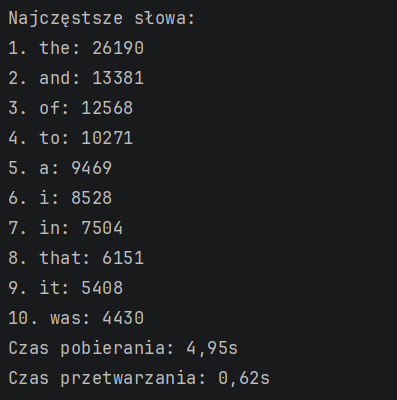

### Zrzut ekranu z wynikami działania programu:

### Użyte metody (Task, Parallel, synchronizacja):
| Kategoria | Użyta Metoda/Klasa | Cel użycia |
| :--- | :--- | :--- |
| **Asynchroniczność (I/O)** | `Task.WhenAll()` | Równoczesne pobranie wszystkich plików z sieci. |
| **Równoległość (CPU)** | `Parallel.ForEach` | Rozłożenie zadania zliczania słów na wiele wątków w celu szybszego przetworzenia. |
| **Synchronizacja** | `ConcurrentDictionary<string, int>` | Zapewnienie bezpieczeństwa wątkowego podczas równoległej modyfikacji słownika przechowującego liczniki słów (`AddOrUpdate`). |

### Jakie techniki zostały użyte do przetwarzania równoległego?
**Równoległość Zadań (`Parallel.ForEach`)**: Do równoległego zliczania słów na wielu rdzeniach procesora.

### Dlaczego synchronizacja była konieczna?
Synchronizacja była niezbędna, ponieważ wiele wątków (utworzonych przez `Parallel.ForEach`) jednocześnie modyfikowało wspólną kolekcję (`wordCounts`). Użycie `ConcurrentDictionary.AddOrUpdate` zapobiegło *wyścigom danych* (Data Race), gwarantując, że każde zwiększenie licznika było operacją atomową i bezpieczną.

### Jak wyglądałby ten kod bez równoległości? Co by się zmieniło?
Bez równoległości, zarówno pobieranie, jak i przetwarzanie, odbywałoby się **sekwencyjnie** w jednym wątku.
* **Pobieranie** trwałoby dłużej (suma czasów pobierania każdego pliku).
* **Przetwarzanie** byłoby znacznie wolniejsze, ponieważ wykorzystywany byłby tylko jeden rdzeń procesora.
* **Synchronizacja** nie byłaby potrzebna, ale ogólna wydajność byłaby znacząco niższa.

### Jak można jeszcze poprawić wydajność?
1.  **Lokalne słowniki:** Stworzenie tymczasowego, lokalnego słownika przez każdy wątek do zliczania słów, a następnie scalenie wyników do globalnego `ConcurrentDictionary`. Redukuje to rywalizację i narzut synchronizacji.
2.  **Optymalizacja tokenizacji:** Użycie bardziej wydajnych metod dzielenia tekstu niż `Regex.Split` (np. `String.Split` na tablicę separatorów lub `Span<T>`), aby zminimalizować alokację pamięci.
